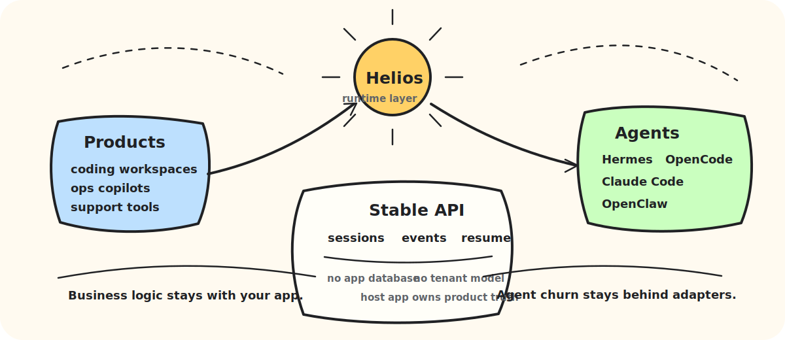
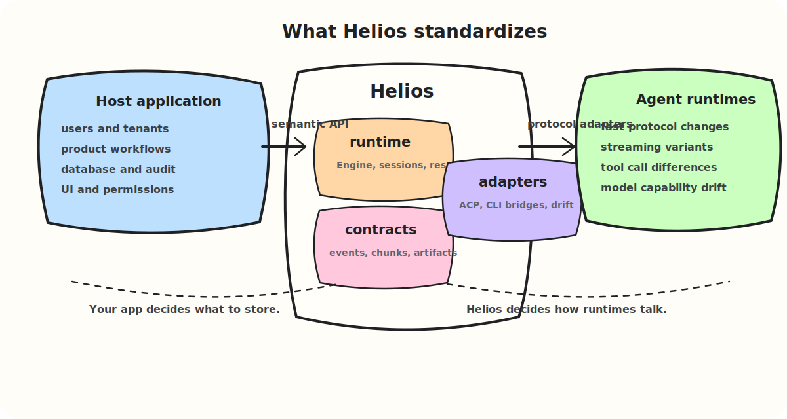
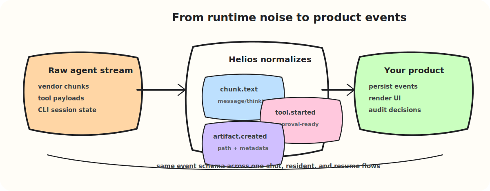

# Helios

**The open runtime layer for AI-native applications.**

<p align="center">
  <a href="#why-helios-exists">Why</a> ·
  <a href="#architecture">Architecture</a> ·
  <a href="#quick-start">Quick Start</a> ·
  <a href="#compatibility-probes">Compatibility</a> ·
  <a href="#examples">Examples</a> ·
  <a href="#project">Project</a>
</p>

Helios lets product teams embed fast-moving foundation agents without turning
their application code into a pile of CLI glue, protocol patches, and streaming
edge cases. It provides stable runtime contracts, normalized event streams,
adapter interfaces, and session orchestration primitives while deliberately
staying out of your database, tenant model, billing, identity, and UI.

> **A small naming easter egg:** Helios is named after the Greek sun god. In
> this project, the name is less about mythology and more about what a runtime
> should do for AI-native software: provide a steady source of light, energy,
> and motion. Helios is meant to sit quietly at the center of an application,
> illuminating agent behavior, powering collaboration, and helping many
> different agents orbit one product goal without every team rebuilding the same
> runtime machinery.

<p align="center">
  
</p>

Helios sits between business applications and agents such as Hermes, OpenCode,
Claude Code, OpenClaw, and future ACP-compatible runtimes. Its job is not to
replace those agents. Its job is to make them safe, stable, observable, and
portable enough to embed in real products.

## Contents

| Start here | Build with Helios | Runtime operations | Project |
| --- | --- | --- | --- |
| [Why Helios Exists](#why-helios-exists) | [Package Layout](#package-layout) | [Runtime Modes](#runtime-modes) | [Versioning And Compatibility](#versioning-and-compatibility) |
| [What Helios Gives You](#what-helios-gives-you) | [Quick Start](#quick-start) | [Runtime Configuration Modes](#runtime-configuration-modes) | [Built-in Adapter Status](#built-in-adapter-status) |
| [Design Principles](#design-principles) | [Examples](#examples) | [Compatibility Probes](#compatibility-probes) | [Project](#project) |
| [Positioning](#positioning) | [Permission Flow](#permission-flow) | [Session Resume](#session-resume) |  |
| [Architecture](#architecture) | [Artifact Flow](#artifact-flow) | [Diagnostics](#diagnostics) |  |
| [Event Flow](#event-flow) | [Multi-Agent Teams](#multi-agent-teams) | [Security Notes](#security-notes) |  |
| [Persistence Boundary](#persistence-boundary) | [Implementation Status](#implementation-status) |  |  |

## Why Helios Exists

Foundation agents are becoming incredibly capable, and also incredibly noisy to
integrate. Their CLIs, protocol envelopes, tool-call shapes, permission flows,
session semantics, model capabilities, and streaming formats can change faster
than product teams can comfortably absorb.

At the same time, serious AI products want to own the parts that make them a
product:

- users, tenants, roles, policy, and audit
- domain workflows and collaboration
- message history and runtime persistence
- UI, notifications, billing, and operations
- safety boundaries around tools and local execution

Without a runtime layer, every application repeats the same work: spawn the
agent, shape the prompt, parse the stream, normalize tool events, handle
questions, persist sessions, recover resumes, chase CLI drift, and then do it
again for the next agent. Helios turns that integration churn into a stable SDK.

## What Helios Gives You

- **A stable semantic event layer** for messages, thinking, tools, questions,
  permissions, artifacts, usage, plans, handoffs, and runtime errors.
- **Session orchestration** for one-shot jobs, resident conversations, and
  resume-aware agent processes.
- **Adapter packages** that track fast-moving agent protocols while keeping
  product code on a small runtime API.
- **Database-free persistence boundaries** so host applications keep ownership
  of their schema, tenancy, and audit model.
- **Compatibility probes** for validating installed CLIs, model endpoints, and
  adapter behavior before enabling them for users.
- **Room to grow** toward model, tool, local skill, MCP, and remote worker
  adapter families without turning Helios into an application platform.

## Design Principles

- Keep the SDK database-free. Applications persist sessions, messages, runs, and
  artifacts through their own stores.
- Normalize runtime events before they reach applications, so product code does
  not need to parse raw CLI or protocol output.
- Support embedded runtimes first, while leaving room for split worker
  deployments.
- Keep adapter interfaces stable enough for CLI agents, model runtimes, MCP
  tools, and future remote workers.
- Keep foundation-agent compatibility inside adapter packages. The core runtime
  event model should be small, stable, and application-oriented.
- Preserve raw protocol metadata alongside normalized fields so applications can
  adopt new agent capabilities without waiting for a core protocol change.

## Positioning

Helios is a runtime adapter layer for AI-native business applications.

It is valuable when an application needs to embed mature external agents but
still own product-level behavior: domain data, workflows, access control,
storage, audit, collaboration, and UI. In that shape, Helios provides:

- Process and session orchestration for embedded or split-worker deployments.
- A stable runtime API over multiple foundation agents.
- Normalized semantic events for messages, thinking, tool calls, questions,
  usage, artifacts, handoffs, plans, and errors.
- Adapter packages that track fast-moving agent protocols and CLI behavior.
- Optional persistence interfaces that let applications store runtime state in
  their own schema.

Helios is not a low-code application builder, a tenant platform, a product UI
framework, or a database abstraction. It is also not just a CLI wrapper. The
core value is the stable semantic layer between business applications and
changing agent runtimes.

## Architecture

Helios has three intentionally separate layers:

- `contracts`: stable types and semantic event envelopes that applications can
  persist, forward, test, and render.
- `runtime`: the embeddable engine for sessions, runs, resume snapshots,
  diagnostics, event sinks, compatibility probes, and lightweight team flows.
- `adapters`: fast-moving integrations for ACP-compatible CLIs and agent
  runtimes. Adapter packages absorb protocol drift so product code does not have
  to.

<p align="center">
  
</p>

## Package Layout

- `contracts`: stable protocol and event types shared by hosts and adapters.
- `runtime`: core SDK abstractions, registry, session store interfaces, and
  runtime path helpers.
- `adapters/acp`: Agent Client Protocol transport and base adapter used by
  ACP-compatible agents.
- `adapters/hermes`: Hermes ACP adapter.
- `adapters/open_code`: OpenCode ACP adapter.
- `adapters/claude_code`: Claude Code adapter using `claude-agent-acp`.
- `adapters/open_claw`: OpenClaw ACP bridge adapter.
- `adapters/all`: helper that registers all built-in adapters.

## Persistence Boundary

Helios does not write to SQLite, MySQL, PostgreSQL, or any application database.
Host applications implement `runtime.EventSink` and `runtime.SessionStore` when
they want to persist runtime events or resume metadata.

## Event Flow

Helios converts unstable runtime output into product-grade events:

<p align="center">
  
</p>

The same event envelope is used across one-shot runs, resident sessions, and
resume flows. Applications can store raw metadata for auditability while relying
on normalized fields for everyday product behavior.

## Implementation Status

Helios is intentionally growing from the runtime center outward. The current SDK
ships the stable runtime contracts, event layer, ACP transport, and built-in CLI
agent adapters first; broader adapter families are tracked as roadmap work.

| Area | Status | Notes |
| --- | --- | --- |
| Runtime contracts and semantic events | Implemented | Versioned event/chunk schema for sessions, tools, questions, permissions, artifacts, usage, plans, handoffs, and errors. |
| Session orchestration | Implemented | One-shot runs, resident sessions, resume helpers, diagnostics, event sinks, and optional session store interfaces. |
| ACP CLI adapters | Implemented | Shared ACP base adapter plus Hermes, OpenCode, Claude Code, and OpenClaw adapters. |
| MCP server wiring | Implemented as pass-through | Host applications pass MCP server specs into sessions; Helios does not yet expose a standalone MCP adapter abstraction. |
| File artifact storage | Implemented as optional utility | Database-free file store for hosts that want SDK-managed artifact bytes. |
| WorkGraph teams | Lightweight primitive | Sequential execution and A2A input capture are implemented; parallel branches, joins, and handoff execution remain roadmap work. |
| ModelAdapter | Planned | Direct model-provider adapter abstraction is not yet separate from CLI agent adapters. |
| ToolAdapter | Planned | Tool execution remains agent/protocol mediated for now. |
| LocalSkillAdapter / Local Bridge | Planned | Local skill and bridge governance are product-roadmap concepts that do not yet have dedicated SDK interfaces. |
| Remote worker runtime | Planned | Current runtime is optimized for embedded processes, with interfaces kept open for split workers. |

## Runtime Modes

Helios supports both common product integration modes:

- One-shot runs: `runtime.Engine.Run` starts a temporary session, prompts the
  agent, streams normalized events, and stops the session. Adapters can also
  implement `runtime.RunAdapter` for native one-shot execution. The engine emits
  session events for both paths; native adapters that return a session id let
  one-shot chunk, artifact, handoff, and usage events carry that same session id.
- Resident sessions: `runtime.Engine.StartSession`, `Prompt`, and `StopSession`
  keep an adapter process alive across turns, which is suitable for chat,
  support, and operations workflows.

ACP adapters expose the lower-level session metadata through
`runtime.SessionInspector`, including the underlying agent session id and
whether native resume was used. Applications can store that metadata in their
own schema and pass it back through `runtime.SessionRequest.ResumeSessionID`.

## Runtime Configuration Modes

Helios separates an agent process working directory from the agent's own
configuration home. Host applications can choose either mode per product,
tenant, domain, workspace, or session.

### Isolated Config Mode

Use isolated mode when the host application needs deterministic, auditable, or
tenant-safe runtime state. This is the recommended default for multi-tenant
products, enterprise apps, shared servers, and governed workflows.

Pass `RuntimeHome` directly, or derive it with `runtime.RuntimeProfile`:

```go
paths := runtime.RuntimeProfile{
    ConfigMode:  runtime.RuntimeConfigIsolated,
    RuntimeRoot: "/var/lib/my-app/agent-runtime",
}.Resolve("support-domain")

handle, err := engine.StartSession(ctx, runtime.SessionRequest{
    SessionID:         "session-123",
    RuntimeConfigMode: paths.ConfigMode,
    RuntimeHome:       paths.RuntimeHome,
    WorkDir:           paths.WorkDir,
    Agent: runtime.AgentSpec{
        Type:         "hermes",
        CLIPath:      "hermes",
        DefaultModel: "qwen-plus",
        APIURL:       "https://model.example/v1",
        APIToken:     token,
    },
})
```

For Hermes, isolated mode writes `RuntimeHome/config.yaml` and sets
`HERMES_HOME=RuntimeHome`. For OpenCode, it sets
`OPENCODE_CONFIG_DIR=RuntimeHome/opencode`. Other adapters use the fields that
their underlying CLI supports.

When a host application has already prepared the exact agent configuration
directory, pass `ConfigDir` instead of `RuntimeHome`. `ConfigDir` is not a
managed runtime root; adapters give it to the underlying CLI as-is. This is the
right mode for applications such as Colink/DevMind that materialize role assets
before starting the agent:

```go
handle, err := engine.StartSession(ctx, runtime.SessionRequest{
    RuntimeConfigMode: runtime.RuntimeConfigIsolated,
    ConfigDir:         "/var/lib/colink/roles/reviewer/.claude",
    WorkDir:           "/workspace/project",
    Agent: runtime.AgentSpec{
        Type:         "claude_code",
        CLIPath:      "claude-agent-acp",
        DefaultModel: "sonnet",
    },
})
```

Adapter mappings for host-provided `ConfigDir`:

| Adapter | Mapping |
| --- | --- |
| `hermes` | `HERMES_HOME=ConfigDir`; generated `config.yaml` is merged into that directory. |
| `claude_code` | `CLAUDE_CONFIG_DIR=ConfigDir`. |
| `open_code` | `OPENCODE_CONFIG_DIR=ConfigDir`. |
| `open_claw` | `OPENCLAW_STATE_DIR=ConfigDir` and `OPENCLAW_CONFIG_PATH=ConfigDir/openclaw.json`. |

### User Config Mode

Use user config mode when a local or personal application should reuse the
user's existing CLI login and default configuration. In this mode Helios does
not set an agent config home; the underlying CLI can use its normal user-level
state, such as `~/.hermes` or its own authenticated profile.

```go
paths := runtime.RuntimeProfile{
    ConfigMode: runtime.RuntimeConfigUser,
    WorkDir:    "/tmp/my-app/session-123",
}.Resolve("")

handle, err := engine.StartSession(ctx, runtime.SessionRequest{
    RuntimeConfigMode: paths.ConfigMode,
    RuntimeHome:       paths.RuntimeHome, // intentionally empty
    WorkDir:           paths.WorkDir,
    Agent: runtime.AgentSpec{
        Type:    "hermes",
        CLIPath: "hermes",
    },
})
```

If no `ConfigDir`, `RuntimeHome`, `RuntimeRoot`, or `WorkDir` is supplied,
Helios infers user config mode. If a host passes `WorkDir` for backward compatibility, Helios
infers isolated mode unless `RuntimeConfigMode` is explicitly set to
`runtime.RuntimeConfigUser`. This lets an application keep an isolated working
directory while still reusing the user's CLI config.

## Quick Start

```go
registry := runtime.NewRegistry()
_ = all.Register(registry)

engine := runtime.NewEngine(registry, runtime.WithEventSink(runtime.EventSinkFunc(
    func(ctx context.Context, event contracts.RunEvent) error {
        // Persist events in the host application's own database.
        return nil
    },
)))

result, err := engine.Run(ctx, runtime.RunRequest{
    Agent: runtime.AgentSpec{
        Type:         "hermes",
        CLIPath:      "hermes",
        DefaultModel: "gpt-4.1",
    },
    Input: "Summarize this workspace.",
})
```

## Compatibility Probes

Use `runtime.CompatibilityHarness` to validate an installed CLI before enabling
it for users:

```go
harness := runtime.NewCompatibilityHarness(engine)
report := harness.Run(ctx, agent, []runtime.CompatibilityCheck{
    {Scenario: runtime.CompatDetect},
    {Scenario: runtime.CompatOneShot, Input: "Say hello"},
    {Scenario: runtime.CompatResident, Input: "Keep this session alive"},
})
```

The harness is intentionally SDK-level. It reports whether a runtime can be
detected, started, prompted, resumed, or asked for capabilities without requiring
Helios to know an application's database or tenant model.

For local CLI probes, use:

```bash
go run ./cmd/helios-compat -agent hermes -cli hermes
```

To validate isolated config mode:

```bash
go run ./cmd/helios-compat \
  -agent hermes \
  -cli hermes \
  -runtime-config-mode isolated \
  -runtime-home /tmp/helios-hermes-home
```

To validate user config mode against an already-authenticated local CLI:

```bash
go run ./cmd/helios-compat \
  -agent hermes \
  -cli hermes \
  -runtime-config-mode user
```

For real CLI + real API key integration tests, use the `integration` build tag:

```bash
HELIOS_INTEGRATION=1 \
HELIOS_AGENT_TYPE=open_code \
HELIOS_AGENT_CLI=opencode \
HELIOS_API_URL=https://model.example/v1 \
HELIOS_API_KEY=... \
HELIOS_MODEL=gpt-4.1 \
go test -tags=integration ./integration
```

These tests are intentionally excluded from default `go test ./...` coverage.
They validate installed agent CLIs, credentials, network access, and real model
responses rather than SDK-only logic.

See [docs/compatibility.md](docs/compatibility.md) for the adapter matrix and
release-gate checklist.

## Examples

Compile-ready examples live under `examples/`:

- `examples/basic`: registry and event sink setup.
- `examples/permissions`: host approval callback shape.
- `examples/artifacts`: file artifact storage helper.

## Permission Flow

When an agent asks for permission, Helios emits a semantic event:

```go
if event.Type == contracts.EventPermissionAsked {
    permission := event.Chunk.Permission
    decision := runtime.PermissionDecision{Allow: true, Reason: "approved by policy"}
    _ = engine.SendPermissionResult(ctx, event.SessionID, permission.ID, decision)
}
```

Applications remain responsible for user policy, audit, and approval UI. Helios
only normalizes the runtime request and transports the decision back to the
adapter.

Question and elicitation results use the same engine-level session routing:

```go
if event.Type == contracts.EventQuestionAsked {
    answer := `{"question_0":"approved"}`
    _ = engine.SendToolResult(ctx, event.SessionID, event.Chunk.ToolID, answer)
}
```

Hosts that cannot tolerate missing audit events can construct the engine with
`runtime.WithStrictEventSink()`. Synchronous sink failures are returned from
session and run operations. Failures from out-of-band session events are
recorded on the active session and surfaced by its next operation and by
`StopSession`.

Adapter defaults should not silently bypass host approval. OpenCode keeps its
own permission default unless the host explicitly sets
`AgentSpec.Metadata["permission"]` or uses `open_code.WithPermissionMode`.

## Security Notes

Helios does not persist API keys or write them to an application database.
Built-in CLI adapters still pass credentials to child processes in the form
those CLIs accept: for example environment variables, generated runtime config,
or process arguments for local bridge tokens. Host applications should protect
runtime home directories, process environments, logs, and diagnostics with the
same care as other secret-bearing infrastructure.

Generated Hermes config files use owner-only `0600` permissions because MCP
headers and environment entries may contain credentials.

## Artifact Flow

Agents can emit `artifact.created` events. Applications may store artifacts in
their own systems, or use the SDK file helper:

```go
store := runtime.NewFileArtifactStore("/var/lib/my-app/runtime-artifacts")
saved, err := store.SaveArtifact(ctx, *event.Artifact)
data, err := store.ReadArtifact(ctx, saved)
```

The file helper keeps artifact paths under a configured root and does not create
or update application database rows.

## Session Resume

Host applications persist `runtime.SessionSnapshot` in their own schema. To
resume:

```go
snapshot, _ := appStore.LoadRuntimeSession(ctx, sessionID)
handle, err := engine.ResumeSessionFromSnapshot(ctx, *snapshot, agent)
```

The snapshot's `AgentSessionID` is passed to the adapter as
`ResumeSessionID`. ACP adapters try native `session/resume`, then `session/load`,
then fall back to `session/new` when necessary.

## Multi-Agent Teams

`runtime.TeamRunner` provides a lightweight WorkGraph runner for simple
agent-to-agent flows:

```go
runner := runtime.NewTeamRunner(engine)
teamResult, err := runner.Run(ctx, runtime.TeamRunRequest{
    Team:   team,
    Agents: agentSpecsByID,
    Input:  "Investigate this issue",
})
```

This is not a workflow platform. It is a small runtime primitive for sequential
agent teams, A2A message capture, and future handoff execution. WorkGraph edges
are used for deterministic ordering. Nodes can be skipped with
`metadata.condition` set to `skip`, `never`, `disabled`, or `false`; parallel
branches and joins are intentionally outside the current runner.

## Diagnostics

Applications can query session diagnostics for health pages or support tooling:

```go
diag, err := engine.Diagnostics(ctx, sessionID)
```

ACP diagnostics include the underlying agent session id, status, captured
stderr, resume strategy, and transport background errors when available.

## Versioning And Compatibility

Helios versions the application-facing semantic layer separately from individual
agent protocol details:

- Runtime events carry `schemaVersion`, currently `helios.semantic.v1`.
- Built-in adapter compatibility expectations are documented as
  `helios.adapters.v1`.
- Normalized fields are intended to evolve conservatively. New fields and event
  types may be added, but existing meanings should not change inside the same
  semantic version.
- Raw protocol payloads remain available through `Chunk.Raw`, `Chunk.Metadata`,
  and capability `Raw` fields so applications can adopt newly released agent
  behavior before Helios promotes it into stable semantic fields.
- Adapter packages are allowed to move faster than the core contracts because
  foundation agents and ACP-compatible CLIs evolve quickly.

For host applications, the recommended persistence key is:

```text
event.schemaVersion + event.type + event.sequence
```

Store raw payloads when auditability or forward compatibility matters.

## Built-in Adapter Status

| Adapter | Runtime mode | Notes |
| --- | --- | --- |
| `hermes` | ACP resident and one-shot | In isolated mode, generates `HERMES_HOME/config.yaml` from `AgentSpec` and MCP server specs. A host-provided `ConfigDir` is used directly as `HERMES_HOME`. In user config mode, leaves `HERMES_HOME` unset so Hermes can use its user-level config. |
| `open_code` | ACP resident and one-shot | In isolated mode, injects `OPENCODE_CONFIG_CONTENT`, isolated config dir, pure mode, and question tool support. A host-provided `ConfigDir` is used directly as `OPENCODE_CONFIG_DIR`. In user config mode, leaves `OPENCODE_CONFIG_DIR` unset. Permission mode is host-configurable and is not forced to `allow` by default. The adapter allocates a per-session HTTP port when needed and internally uses OpenCode's `/question` API to answer AskUserQuestion prompts while keeping the host-facing `SendToolResult` API unchanged. |
| `claude_code` | ACP resident and one-shot | Uses `claude-agent-acp` as the default CLI, maps API token/base URL to environment variables, and maps a host-provided `ConfigDir` to `CLAUDE_CONFIG_DIR`. |
| `open_claw` | ACP resident and one-shot | Builds OpenClaw ACP bridge arguments for an existing gateway endpoint. A host-provided `ConfigDir` is mapped to OpenClaw state/config env vars. Gateway lifecycle management belongs to the host application for now; resume prefers `ResumeSessionID` when provided. |

These adapters provide SDK-level support and unit-tested configuration behavior.
Real CLI compatibility should still be validated by each host application in its
own environment, because installed CLI versions and protocol details can differ.

## Project

- License: [Apache 2.0](LICENSE)
- Contributing guide: [CONTRIBUTING.md](CONTRIBUTING.md)
- Release guide: [RELEASING.md](RELEASING.md)
- Changelog: [CHANGELOG.md](CHANGELOG.md)
